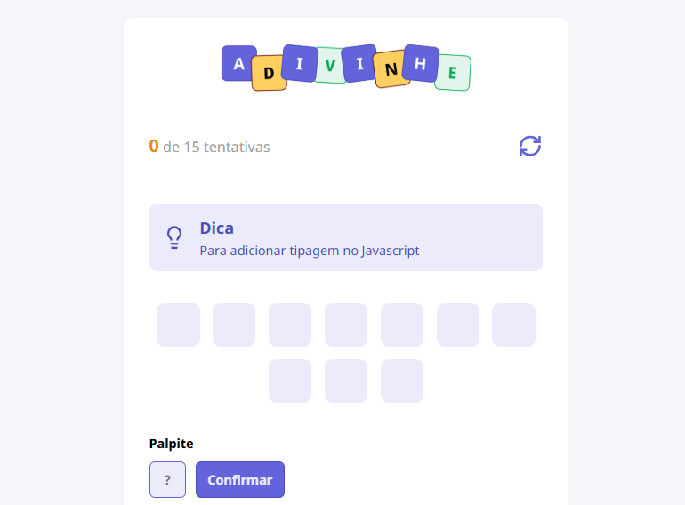

<h1 align="center"> Adivinhe - Jogo de Palavras </h1>

<p align="center">
  Um jogo interativo de adivinhação de palavras focado em tecnologias Web, desenvolvido para introdução aos conceitos do React.
</p>

<p align="center">
  <a href="#-tecnologias">Tecnologias</a>&nbsp;&nbsp;&nbsp;|&nbsp;&nbsp;&nbsp;
  <a href="#-projeto">Projeto</a>&nbsp;&nbsp;&nbsp;|&nbsp;&nbsp;&nbsp;
  <a href="#-como-rodar">Como Rodar</a>&nbsp;&nbsp;&nbsp;|&nbsp;&nbsp;&nbsp;
  <a href="#memo-licença">Licença</a>
</p>

<p align="center">
  
</p>

<br>

<p align="center">
  
</p>

## 🚀 Tecnologias

Esse projeto foi o meu primeiro contato com o ecossistema React, utilizando:

- **[React](https://reactjs.org/)** (Componentização e Hooks)
- **[TypeScript](https://www.typescriptlang.org/)** (Tipagem estática de Props e Estados)
- **CSS Modules** (Estilização escopada para evitar conflitos)
- **Vite** (Build tool rápida)

## 💻 Projeto

O **Adivinhe** é um jogo onde o usuário deve descobrir qual é a tecnologia baseada em uma dica apresentada na tela.
O objetivo técnico foi praticar a passagem de propriedades (**Props**) entre componentes e o gerenciamento de estado (**useState**) para controlar o fluxo do jogo.

Mecânica do jogo:
- O sistema escolhe aleatoriamente uma palavra de um banco de dados local (`utils/words.ts`).
- Uma dica é exibida (ex: "Linguagem de estilos" para "CSS").
- O jogador tem um número limitado de tentativas para acertar.
- A interface exibe o progresso (ex: "1 de 3 tentativas") e permite reiniciar a partida a qualquer momento.

## 📂 Estrutura

O código foi organizado em componentes funcionais para facilitar a manutenção:
- `Header`: Exibe o logo, o contador de tentativas e o botão de reset.
- `Button` & `Input`: Componentes reutilizáveis estilizados via CSS Modules.
- `Utils`: Separação dos dados (array de palavras) da lógica de interface.

## 🎲 Como Rodar

```bash
# Clone este repositório
$ git clone [https://github.com/miqueiassantoss/adivinhe.git](https://github.com/miqueiassantoss/adivinhe.git)

# Acesse a pasta do projeto
$ cd adivinhe

# Instale as dependências
$ npm install

# Execute a aplicação
$ npm run dev

```

## 📝 Licença

Esse projeto está sob a licença MIT.

---

<p align="center">
  Feito por <a href="https://github.com/miqueiassantoss">Miqueias Santos</a>
</p>